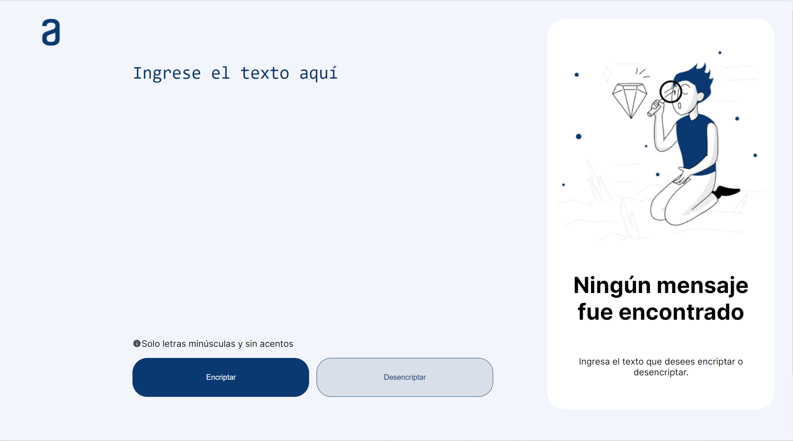

 

<h1>Encriptador de texto 👾</h1> 

 
<h3 style = "text-align: center"><a>Demo</a></h3>
<h2>Sobre el proyecto 💻</h2>
Es una pagina que fue propuesta por Alura en el programa de Oracle Next Education, en donde se ponen a prueba nuestras habilidades adquiridas durante esta etapa del programa. Logrando asi desarrollar un sitio web responsivo e interactivo que se baso en un modelo de Figma.
<h2>¿Qué hace? 😺</h2>
Encripta y desencripta texto basado en las siguientes condiciones. 
<h3>Para encriptar</h3>
- La letra "e" es convertida en "enter" 
- La letra "i" es convertida en "imes" 
- La letra "a" es convertida en "ai" 
- La letra "o" es convertida en "ober" 
- La letra "u" es convertida en "ufat" 

<h3>Para desencriptar</h3>
- La cadena "enter" es convertida en "a" 
- La cadena "imes" es convertida en "e" 
- La cadena "ai" es convertida en "i" 
- La cadena "ober" es convertida en "o" 
- La cadena "ufat" es convertida en "u" 

